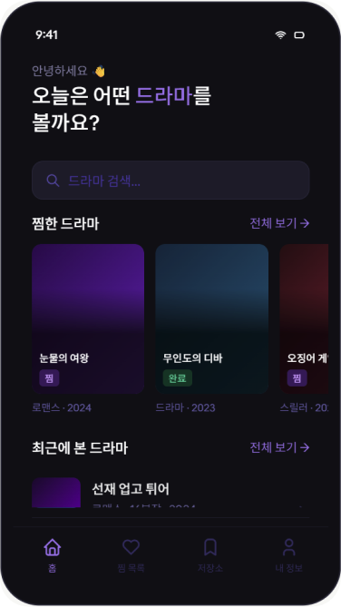
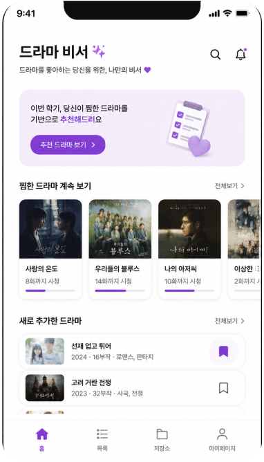
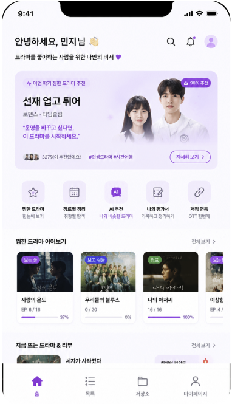
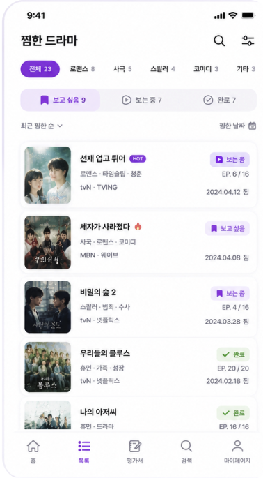
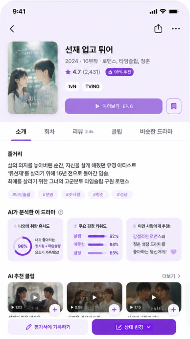
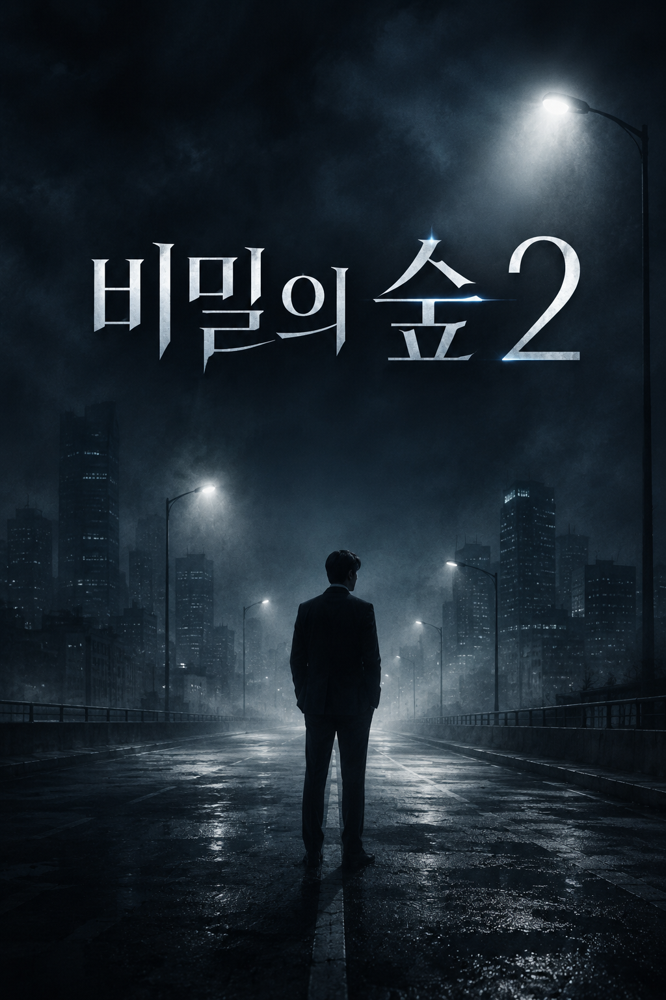
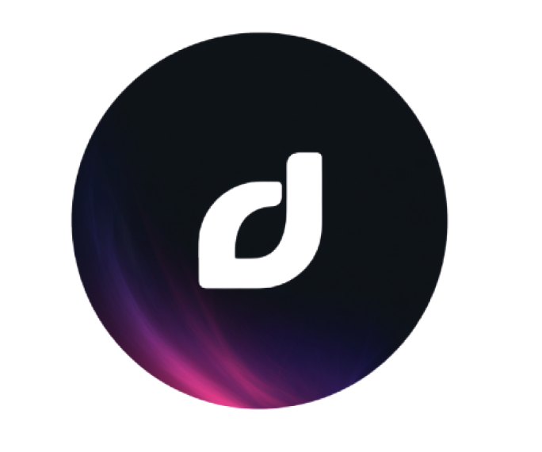
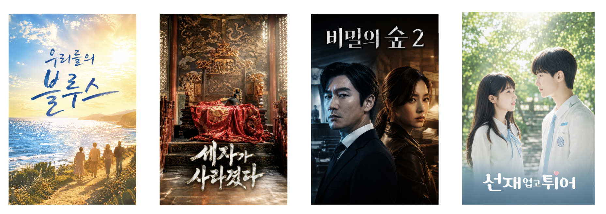
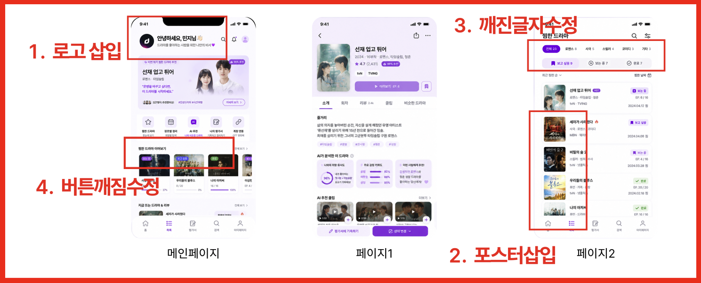

# 📋 작업 로그 문서

---

## 1. 작업 컨셉

드라마를 좋아하는 사람들을 위한 모바일 어플리케이션 제작을 진행하고자 한다.

해당 UI에 포함될 **핵심 기능**은 다음과 같다:

1. 나만의 드라마 저장소 제공
2. 드라마 찜 (좋아요 기능)
3. 드라마 별 요약 줄거리 제공
4. 드라마 평점 확인 가능
5. 찜한 드라마를 기반으로 사용자 맞춤형 드라마 추천 **(AI 기반)**

---

## 2. AI 모델 선정

### 2.1 로고 제작 및 이미지 생성용 모델 선정

#### 1) 로고 제작

> **선정 모델 : Midjourney**
>
> 현재 이미지 생성 AI 모델 중 성능이 높다고 평가되며, 기존에 Midjourney 유료 버전을 사용하는 팀원이 있어 그 성능을 함께 파악하고 공유해보기 위함이다.

#### 2) 이미지 생성

> **선정 모델 : ChatGPT**
>
> ChatGPT DALL-E의 이미지 생성 능력이 매우 우수하다는 평가를 듣고, 친숙한 GPT를 이미지 생성의 용도로도 적극 활용해보고자 사용하게 되었다.

---

### 2.2 UI 비교 AI 모델 후보

> **비교 모델 : Claude vs GPT**
>
> Claude의 경우 우수한 성능으로 유명하여 팀원 모두가 자주 사용하는 툴이었지만, 이미지 생성을 위해 사용해본 적은 많지 않아 이미지 성능까지 확인해보고 싶은 의도가 있었다. 최근 AI 관련 특강에서 이미지 생성 모델은 GPT가 성능이 압도적이라는 설명을 듣고 온 팀원의 조언에 따라 Claude와 GPT의 성능을 비교해보고자 하였다.

---

### 2.3 작업 결과 비교

#### 비교 기준

| 기준 | 설명 |
|------|------|
| **기준 1. 레이아웃** | 화면 구성 및 정보 배치의 완성도 |
| **기준 2. 심미성** | 시각적 디자인의 완성도 및 타겟층 적합성 |
| **기준 3. 정보 이해 효율성** | 기능 및 요소에 대한 3초 이내 직관적인 이해 및 올바른 정보 전달 |

#### 작업 결과물

> 📷 **그림 1.** Claude 결과물 (좌측) / GPT 결과물 (우측)

| Claude 결과물 | GPT 결과물 |
|:---:|:---:|
|  |  |

---

### 2.4 선정 결과 및 사유

| 비교 항목 | GPT | Claude |
|---|---|---|
| **레이아웃** *(최대 5점)* | **3점** | **4점** |
| | ㆍ"시청 중인 드라마" 리스트를 상단에 배치하여 현재 시청 중인 드라마 정보가 우선 제공되는 점 긍정적 ㆍ한 페이지에 너무 많은 정보를 담으려다 보니 각 버튼 및 UI 구성이 다소 답답하거나 복잡하게 느껴짐 | ㆍ전반적으로 각 UI 크기·구성이 깔끔함 ㆍ한 페이지 내에 너무 많은 것들을 구성하지 않으려 한 점 높게 평가 ㆍ버튼 및 텍스트 기반 정보 크기·위치 우수 |
| **심미성** *(최대 5점)* | **4점** | **4점** |
| | ㆍ타겟층을 고르게 선정 ㆍ시청들에 대한 기록이 제대로 보여서 좋음 | ㆍ너무 어두운 컨셉 (색상 대비가 정확하지 않음) ㆍ검색바가 직관적 ㆍ이미지 요소가 채워지지 않음 ㆍ매니악한 층은 좋아할 수 있는 UI |
| **정보 이해 효율** *(최대 5점)* | **5점** | **3점** |
| | ㆍ부작 정보와 드라마 카테고리까지 상세하면서도 다양한 정보를 잘 전달함 ㆍAI 기반 사용자 맞춤형 드라마 추천 기능 구성 → 높게 평가 ㆍ드라마 시청 진행 상황 정보 제공 | ㆍ정보가 충분하지 않음 ㆍ네비게이션바/탭에 대한 직관적인 이해 가능 |
| **최종 점수** *(최대 15점)* | **🏆 12점** | **11점** |

> ✅ **최종 선정 모델 : GPT**

---

## 3. 작업 로그

### 3.1 작업 환경

- **피그마 (Figma)**
  - GPT 모델과 프롬프트 기반 작업을 진행하되, 마음에 들지 않는 디자인 요소는 피그마 내에서 직접 수정하여 프로토타입 제작

---

### 3.2 프롬프트 v1

#### 📝 프롬프트 내용

```
목적: 드라마를 좋아하는 사람들을 위한 앱.

내용:
- 학기 중 찜했던 드라마를 추천함
- 찜한 드라마 볼 수 있음
- 줄거리를 추가하여 사용자에게 보여줌
- 나만 볼 수 있는 드라마 저장소를 만들고자 함
- 드라마를 누르면 관련 정보가 나타남

한 줄 정리: 드라마를 좋아하는 사람을 위한 나만의 비서

위 내용으로 만들어야 모바일 앱을 만들거야. 너는 모바일앱 화면을 보여주면 돼.
위 내용을 이해하고 메인, 목록, 상세에 알맞게 각각 만들어. 그러면 총 3장 나와야겠지.
너는 이미지를 만들거고, 만들기 전에 부족해 보이는 점이 있거나 추가하고 싶은 점이 있으면 나에게 추천해.
마음대로 추가하지 말고. 그리고 3개의 이미지를 다 만들기 전에 먼저 메인 이미지 하나만 만들고
괜찮으면 나머지도 만들라 할게. 이해했지?
```

#### 🖼️ 결과물

| 메인 화면 |
|:---:|
|  |

#### ⚠️ 문제점

1. 'AI 기반으로 사용자 맞춤형 추천을 해줄 수 있다'에서 그치지만, 사용자는 **어떤 드라마를 추천해줄 것인지, 왜 추천해주는지** 직관적으로 알 수 있게 내용 구성 필요
2. 찜한 드라마 UI에 상태 카테고리화 필요
   - 앞으로 볼 의향이 있는 작품
   - 현재 시청 중인 것
   - 이미 다 봤는데 저장해두는 드라마
3. 나만 볼 수 있는 드라마에 대한 **평가서 UI** 구성 필요
4. 특정 드라마를 **찜한 날짜**를 알 수 있는 UI 구성 필요
5. 계정 연동하여 특정 드라마를 **OTT로 바로 볼 수 있는 UI** 구성 필요
6. 흥미 유발을 위해 **타인의 리뷰와 인기도 제공** 기능 추가 필요

---

### 3.3 프롬프트 v2

#### 📝 수정 프롬프트 내용

```
목적: 드라마를 좋아하는 사람들을 위한 앱.

문제:
- 대학생은 학기 중 대외활동, 수업, 시험 등으로 드라마를 본방사수하거나 정주행하는 것이 어려울 때가 있어 항상 종강만을 기다림
- 하지만 막상 종강하면 무엇을 보고 싶어했는지 헷갈리고 새로운 콘텐츠를 보기 바쁨
- 새로 나온 드라마가 나의 취향인지 알고 시작하고 싶어함
- 내가 본 드라마에 대해 간략하게 정리하고 싶어함 (명장면, 추천 이유, 명대사 등)
- OTT가 다양해서 어디서 볼 수 있는지 찾아야 하는 번거로움 있음
- 각 OTT로 나뉜 찜한 콘텐츠 한 번에 정리 필요

내용:
- 학기 중 찜했던 드라마를 추천 (타인의 리뷰 및 시사적 내용과 함께 제공 → 흥미 유발)
- 찜한 드라마를 장르별로 분리 / 상태 구분 (보고싶음 / 보는중 / 완료) / 찜 날짜 표기
- 키워드 중심으로 정리하고 줄거리 추가하여 사용자에게 제공
- 나만 볼 수 있는 드라마 평가서 제공
- 드라마를 누르면 관련 정보 제공
- AI를 이용해 평소 사용자 or 추구미와 같은 드라마를 찾아 추천하고 해당 클립 제공
- 계정 연동 시 정리 가능 / 바로가기 버튼 제공

한 줄 정리: 드라마를 좋아하는 사람을 위한 나만의 비서
```

#### 🖼️ 결과물

| 메인 화면 | 목록 화면 | 상세 화면 |
|:---:|:---:|:---:|
|  |  |  |

#### ⚠️ 문제점 및 개선점

- 해당 어플리케이션의 **로고 추가** 필요
- 디테일/형태 왜곡, 환각 현상 등 생성형 AI 모델의 한계로 인한 **어색한 드라마 포스터 수정** 필요
- 몇몇 **깨진 텍스트 수정** 필요

---

### 3.4 프롬프트 v3

#### 1) 로고 제작

##### 📝 프롬프트 내용

```
A sleek typography app icon featuring a geometric letter 'D',
designed for a drama recommendation platform,
the 'D' shape contains dreamy and cosmic patterns with purple and pink galaxy textures,
subtle glowing edges, modern clean aesthetic, isolated on a plain white background,
flat design with depth --v 6.0

핵심 키워드 : 입체감, 우주 질감, 네온 광원
```

##### 🖼️ 결과물

| v3 로고 결과물 |
|:---:|
|  |

##### ⚠️ 문제점 및 개선점

- 알파벳 'D' 내부에 채워진 우주/은하수 패턴과 반짝이는 디테일이 너무 화려하여, 스마트폰 화면에서 아이콘이 작아졌을 때 **(Small Size UX)** 형태가 뭉개지고 시선이 분산되는 문제
- 3D 효과와 입체감이 강해 최근 모바일 앱 UI 트렌드인 **미니멀리즘** 및 **플랫 디자인** 스펙에 완벽히 녹아들기에는 다소 무거움

> 🔄 **재디자인 필요 판단**

---

#### 2) 드라마 포스터 제작

##### 📝 프롬프트 내용

```
비밀의 숲2 라는 이름의 가상의 스릴러/범죄/수사 드라마 포스터를 제작해줘.
```

##### 🖼️ 결과물

| v3 포스터 결과물 |
|:---:|
|  |

##### ⚠️ 문제점 및 개선점

- '비밀의 숲'이라는 컨셉에 대해 **모호한 포스터 디자인**
- '드라마 포스터'라는 컨셉에 맞게 **인물 강조** 필요
- 주요 등장인물인 두 남녀 중심의 **구도 변경** 필요

> 🔄 **재디자인 필요 판단**

---

### 3.5 프롬프트 v4 (최종)

#### 1) 로고 제작

##### 📝 프롬프트

```
A basic app logo for a drama platform named Dramady,
simple circle, dark colors, solid white background

핵심 키워드 : 기본 구조, 단순한 원형, 어두운 톤

의도 : 기존의 복잡한 우주 패턴을 전면 삭제하고 'simple circle' 키워드를 적용해
완벽한 원형 심볼 형태로 구조를 단순화. 몽환적인 감성은 유지하되,
'dark colors'를 활용해 은은한 퍼플/핑크 빛이 도는 어두운 그라디언트 배경 연출.
```

##### 🖼️ 결과물

| v4 로고 최종 결과물 |
|:---:|
|  |

---

#### 2) 드라마 포스터 제작

##### 📝 프롬프트

**1) 선재 업고 튀어**

```
드라마 포스터 이미지를 생성해줘. 선재 업고 튀어라는 이름의 드라마야.
현재 내가 보낸 이미지를 참고해서 포스터 이미지를 생성해줘.
포스터 하단에 자연스러운 느낌으로 한국어로 "선재 업고 튀어"라는 타이틀이 선명하게 적혀 있어야 함.
다른 텍스트는 제외하고 지정된 한글 타이틀만 정확히 표기할 것.
```

**2) 우리들의 블루스**

```
드라마 포스터 이미지를 생성해줘.
푸르고 맑은 바다를 배경으로 한 따뜻한 휴먼 성장 드라마 포스터.
반짝이는 윤슬이 가득한 바닷가 위로 밝고 청량한 햇살이 쏟아지고 있다.
해안가를 따라 걷는 사람들의 다정한 실루엣이 보이며, 화면 전체에 따뜻하고 감성적인 에너지가 가득하다.
전체적으로 따스한 햇살의 오렌지빛과 청량한 바다의 블루빛이 어우러진 색감.
세로형 포스터 구도(화면비 2:3).
포스터 중앙에 손글씨(캘리그라피) 느낌의 자연스러운 한국어로 "우리들의 블루스"라는 타이틀이 선명하게 적혀 있어야 함.
다른 텍스트는 제외하고 지정된 한글 타이틀만 정확히 표기할 것.
```

**3) 세자가 사라졌다**

```
드라마 포스터 이미지를 생성해줘.
조선 시대를 배경으로 한 미스터리 사극 드라마 포스터.
주인을 잃고 텅 빈 화려한 왕좌(용좌) 위에 세자의 관모(익선관)와 붉은색 곤룡포가 쓸쓸하게 흐트러져 있다.
어두운 궁궐 내부, 창문 틈으로 들어오는 한 줄기 날카로운 빛이 텅 빈 왕좌만을 강렬하게 비추며 긴장감과 미스터리한 분위기를 연출한다.
세로형 포스터 구도(화면비 2:3).
포스터 중앙 하단에 묵직하고 거친 붓글씨(캘리그라피) 형태의 한국어로 "세자가 사라졌다"라는 타이틀이 선명하게 적혀 있어야 함.
다른 텍스트는 모두 제외하고 지정된 한글 타이틀만 표기할 것.
```

**4) 비밀의 숲 2**

```
드라마 포스터 이미지를 생성해줘.
대한민국 범죄 수사 스릴러 드라마 포스터.
날카롭고 이성적인 눈빛의 정장 차림 남자 검사와 강인한 표정의 가죽 재킷을 입은 여형사가 서로 등을 지고 서 있다.
두 인물의 얼굴과 강렬한 표정이 화면 전면에 클로즈업되어 매우 잘 보인다.
한쪽 인물에게는 차가운 블루 조명이, 다른 쪽 인물에게는 웜 톤의 조명이 비쳐 명확한 대비를 이룬다.
배경은 흐릿하게 블러 처리된 법정 내부와 서류가 가득한 사무실의 실루엣.
세로형 구도(화면비 2:3).
상단에 깔끔하고 날카로운 서체의 한국어로 "비밀의 숲 2"라는 타이틀이 선명하게 적혀 있어야 함.
다른 텍스트는 제외할 것.
```

##### 🖼️ 최종 결과물 (Worked on Figma)

| 드라마 포스터 최종 결과물 |
|:---:|
|  |

| 텍스트 깨짐, 버튼 깨짐, 포스터, 로고 반영 최종 결과물  |
|:---:|
|  |

---

## 4. 고찰

### 4.1 AI 모델

1. 현재 GPT와 Claude 모델 모두 이미지 생성 능력이 뛰어나나, **대중적인 취향**을 고려할 수 있는 건 GPT 모델이고, **최신 트렌드 기반 특정 타겟층**을 위한 이미지 생성에는 Claude 모델이 특장점을 가질 수 있다.

2. GPT의 경우 세세한 이미지/기능이라도 빠짐없이 구성하여 제공하려고 노력하지만, **Claude의 경우 요소를 빼먹는 경우가 종종 발생**했으며 이미지의 저작권을 과하게 제재하여 일부 요소/이미지를 제외하는 경우도 있었다.

3. 창의적으로 생성하기를 요구하였지만, GPT와 Claude 모두 **쿼리를 던진 사용자의 맞춤형 결과물 생성에 집중**하여 완전히 색다른 아이디어나 디자인을 얻지는 못하였다.

4. 모델 고도화 수준이 높아졌음에도 **아직 텍스트 깨짐이나 이미지 생성 기능이 정상 수준은 아님**을 확인하였다. 특히 요구되는 기능이 많을수록 이 문제가 심화된다는 것을 경험하였다.

> 💡 각 생성형 AI 모델의 장/단점을 잘 파악하고 실제 결과물을 통해 경험해볼 수 있던 좋은 기회였다.

---

### 4.2 프롬프트 엔지니어링

1. 단순히 '팬페이지를 만들고 싶다'라고 하는 것과, **해당 팬페이지의 목적과 문제를 구체적으로 작성해주는 것**은 결과물에 있어 상당한 차이가 있음을 느꼈다.

2. 무료 버전 사용으로 토큰 수가 한정된 경우, 여러 이미지를 한 번에 제작하기보다 **AI에게 추가 정보를 요구하고 목표하는 바를 추가 수정하도록 하여 결과물 예시를 먼저 확인한 뒤 본격적인 작업을 진행**하도록 프롬프트에 요청하는 것이 중요함을 느꼈다.

3. 애매한 요청이 들어온 경우 **다시 되묻고 정확한 정보를 확정한 후에 결과물을 생성**하게끔 프롬프트에 명시하는 것이 중요하다는 것을 다시금 깨닫게 되었다.
